<div align="center">


<p>
  
  
  
</p>

</div>

```text
guest@yuvraj-dev:~$ whoami
──────────────────────────────────────────────────────────────────────
  editor      vs code / pycharm / cursor / antigravity
  shell       bash
  languages   javascript · typescript · python · java · c++
  stack       react.js · next.js · node.js · fastapi
  focus       ai/ml · full-stack apps · dev tooling · open source
──────────────────────────────────────────────────────────────────────
```

## about

Software engineer who enjoys building products, exploring AI, contributing to open source, and solving the occasional DSA problem for fun (and sanity). Usually mid-experiment with something new — ask again next week and the stack may have changed.

## currently building

<div align="center">

<table>
<tr>
<td align="center" width="600">

<h3><a href="https://thedigitalprofile.com">thedigitalprofile.com</a></h3>

Create one beautiful profile to showcase everything you do — in a single link.


<br /><br />

<a href="https://thedigitalprofile.com"></a>

</td>
</tr>
</table>

</div>

<!-- GITHUB_STATS_START -->

<div align="center">



<sub>auto-generated · refreshed 2026-09-06 07:43 UTC</sub>

</div>

<!-- GITHUB_STATS_END -->

<details>
<summary><b>▸ tech stack</b></summary>
<br>

<table align="center">
<tr>
<td><b>Languages</b></td>
<td>
  
  
  
  
  
</td>
</tr>
<tr>
<td><b>Frontend</b></td>
<td>
  
  
  
  
  
</td>
</tr>
<tr>
<td><b>Backend</b></td>
<td>
  
  
  
  
</td>
</tr>
<tr>
<td><b>Database</b></td>
<td>
  
  
  
  
</td>
</tr>
</table>

</details>

<div align="center">
  
</div>

## connect

<div align="center">

[](https://yuvrajkarna.pages.dev)
[](https://www.linkedin.com/in/yuvrajkarna)
[](https://x.com/yuvrajkarna)
[](https://yuvrajkarna.medium.com/)
[](https://www.leetcode.com/u/yuvrajkarna)
[](mailto:yuvrajkarna.code@gmail.com)

</div>

<div align="center">
  

  <sub>$ echo "talk is cheap. show me the code." — Linus Torvalds</sub>
  <br />
  <sub>⭐ from <a href="https://github.com/yuvrajkarna2717">yuvrajkarna2717</a></sub>
</div>